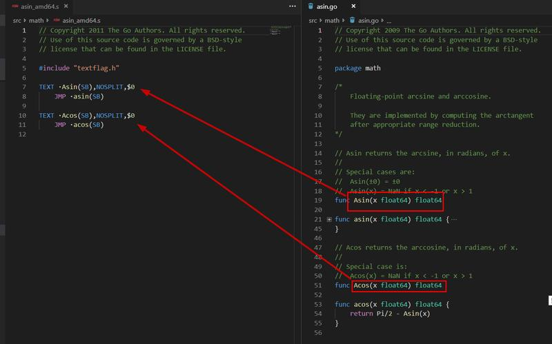

# 回答型问题

1. 有哪些方法可以使当前 goroutine 永久堵塞？
   
    1-for{}
    2-select{}
    3-<-make(chan int)
2. 哪些不能作为常量？
3. Go 的嵌入为什么不算继承？
    
    参考：
     [官方解释](https://golang.org/doc/faq#Is_Go_an_object-oriented_language)

4. Go 语言中，如何通过代理访问第三方的 HTTP 接口？有哪些方法？
    
   1. 使用http. Transport 
   2. 也是最简单的，直接配置系统代理
5. 标准库中有一些函数只有签名（builtin 中的忽略），没有实现。
你知道实现在哪吗？使用什么方式做的。你自己试着写一个这样的函数？

    
6. Go 中有哪些注释是有特殊意义的？
7.  结束 goroutine 的方法有哪些？
8. 网站累计访问人数统计，为了保证正确，在 Go 中有哪些方法？

    原子函数：atomic.AddInt64(&counter, 1)
    
9. Go 中一包可以被同一个文件引入多次吗？如果可以怎么做？

    可以，使用别名 
    ```go
    package main
    import (
     "fmt"
     f "fmt"
     t "fmt"
    )
    func main(){
    	f.Println()
    	t.Println()
    	fmt.Println()
    }    
    ```
10. sync.Once 这个类型了解吗？一般怎么使用？

    1. Do只会执行一次，单例模式可以用
    2. 避免资源重复加载
11. import . 这种包导入形式是什么意思？一般什么情况下会使用？
    
    1. 建议测试时使用，测试文件不能在包foo中，因为它使用bar / testutil，它导入foo。所以我们使用'导入'。表单让文件伪装成包foo的一部分，即使它不是。
    [官方参考](https://github.com/golang/go/wiki/CodeReviewComments#import-dot)
    2. 省略使用时引用报名，不建议使用
12. Nginx 是一个反向代理服务器。为什么是反向代理？那什么是正向代理

    1. 正向代理：正向代理类似一个跳板机，代理访问外部资源。
    （1）访问原来无法访问的资源，如google 
    （2） 可以做缓存，加速访问资源
    （3）对客户端访问授权，上网进行认证
    （4）代理可以记录用户访问记录（上网行为管理），对外隐藏用户信息
    
    2. 反向代理：平台转发，接收外部资源请求 
    （1）负载均衡
     2）服务器安全
13. 在浏览器中输入：https://baidu.com 到页面显示出来，你能描述下中间都经历了什么，涉及到什么技术，越详细越好。
    
    1. 首先在浏览器缓存查找baidu.com的IP地址（如果有的话），再在系统缓存查找IP地址→路由器dns缓存→isp的dns缓存→isp的dns服务器从根服务器递归搜索（一般不用查这么长）。
    2. 查到IP地址后，浏览器作为客户端添加443端口后发起tcp连接（三次握手），向百度服务器发起一条HTTP
    get请求，
    3. 中间可能经历很多代理，
    4. 百度服务器收到请求后， 
    5. 没有问题的话就返回一条响应，
    6. 客户端读取HTTP响应报文渲染在屏幕上，
    7. 最后浏览器关闭连接
    
14. 直播中提到的，为什么 TCP 连接叫 3 次握手，而断开却叫 4 次挥手？ TODO
15. 开发测试中，我们有时候会需要配置本地 host，那么，在 Go 语言中，如何实现类似配置 host 的功能
    [  Golang 代码中绑定Host – Go语言中文网博客](http://blog.studygolang.com/2014/02/golang_host/)

16. 如何控制并发执行的 Goroutine 的最大数目？
[控制一下 Goroutine 的并发数量](https://segmentfault.com/a/1190000017956396)